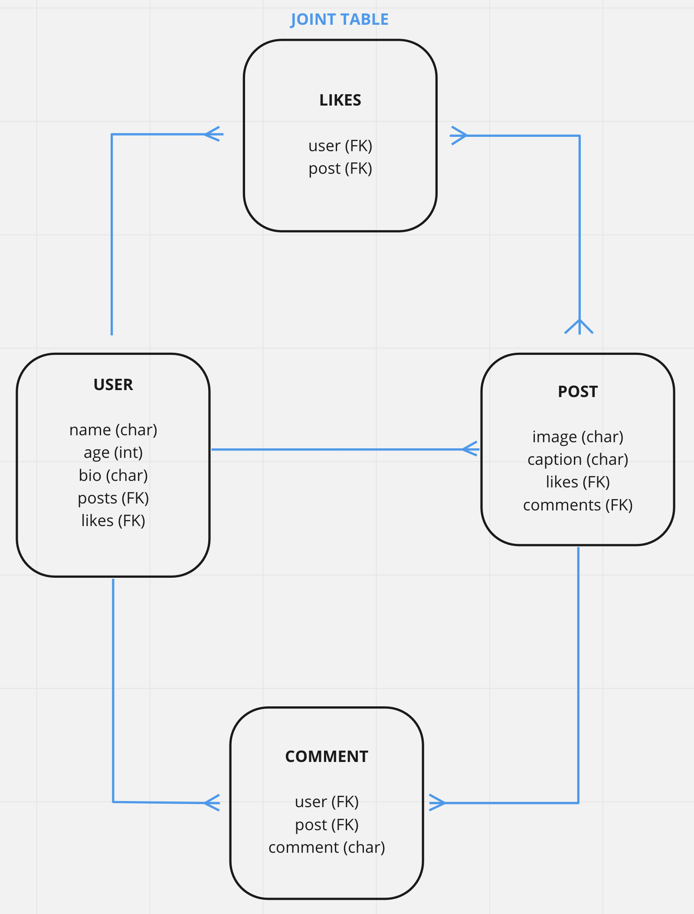

# Pixel Perfect

## Description

Picture Social is a social media platform that allows users to share and discover new photos. Users can create an account, follow other users, and share their own photos with the community. The platform also includes socially-interactive features such as likes, comments, and messages to help engage users on the site.

## ERD

## Technologies Used

Python - Functionality  
Django - Framework  
PostgreSQL - Database  
Materialize - Front-end framework

## Pseudocode

Below is an example of some pseudocode for the process of a user uploading a new photo to the platform:

Copy code
def upload_photo(request): # Check if the request method is POST
if request.method == 'POST': # Create a new PhotoForm instance with the POST data
form = PhotoForm(request.POST, request.FILES) # Check if the form is valid
if form.is_valid(): # Save the new photo to the database
photo = form.save() # Redirect the user to the photo's detail page
return redirect(photo.get_absolute_url()) # If the request method is not POST, render the upload form
else:
form = PhotoForm()
return render(request, 'photos/upload.html', {'form': form})

Entity Relationship Diagram (ERD)
Below is an example of an Entity Relationship Diagram (ERD) for the Picture Social application:

(pic goes here)

The ERD shows the relationships between the following entities:

User
Photo
Comment
Like
Each user can upload multiple photos, and each photo can have multiple comments and likes. The relationships between these entities are represented by the lines connecting them in the diagram.
