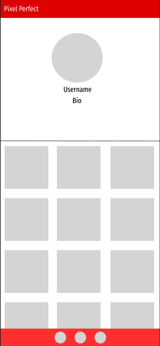

# Pixel Perfect

## Created by: Sam, Madeira, Zack, and Dom

## Description

With Pixel Perfect, you can share your photos and connect with friends and followers from around the world. Our platform is easy to use and offers a variety of features to enhance your social media experience. You can create a profile, share your photos, and engage with others by following other profiles, and liking or commenting on their photos. Whether you're a professional photographer or just love to share your life with others, our website is the perfect place to do it. Thanks for stopping by!

## ERD

## Wireframe

## Technologies Used

Python - Functionality  
Django - Framework  
PostgreSQL - Database  
Materialize - Front-end framework  
InkScape - Logo  
Figma - Wireframe  
Miro - ERD  
Trello - https://trello.com/b/YrjuafoO/group-project-pixel-perfect

## Screenshots

## Next Steps/Further Implementation

1. Add notifications when a user likes or comments on your photo
2. Create albums where you a user can post multiple photos per post
3. Chat implementation
