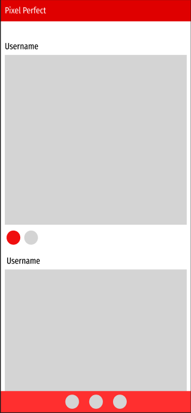

# Pixel Perfect

## Description

Here you can share your photos and connect with friends and followers from around the world. Our platform is easy to use and offers a variety of features to enhance your social media experience. You can create a profile, share your photos, and engage with others through likes and comments. Whether you're a professional photographer or just love to share your life with others, our website is the perfect place to do it. Thanks for stopping by!

## ERD

## Wireframe

## Technologies Used

Python - Functionality  
Django - Framework  
PostgreSQL - Database  
Materialize - Front-end framework
InkScape - Logo
Wireframes - Figma

## Screenshots
